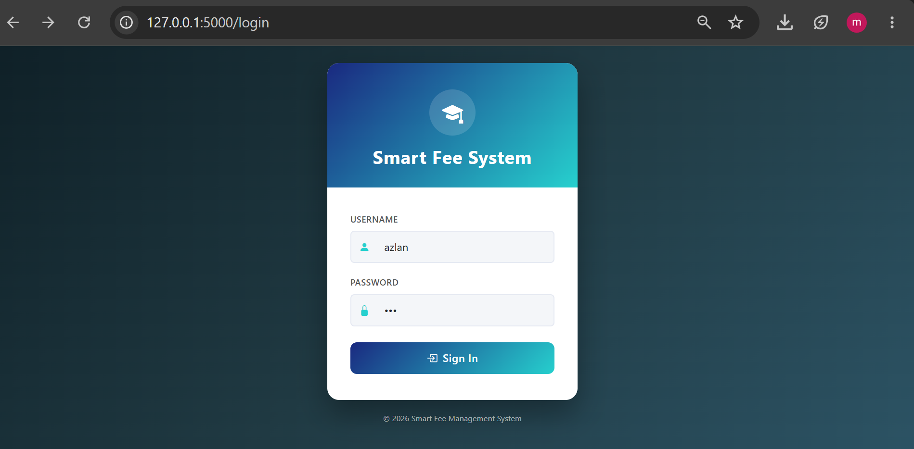
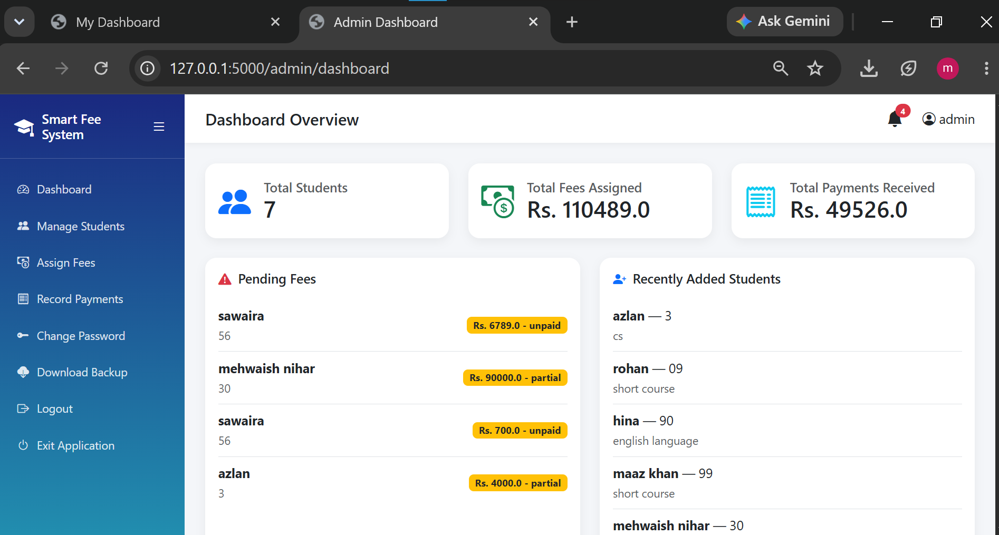
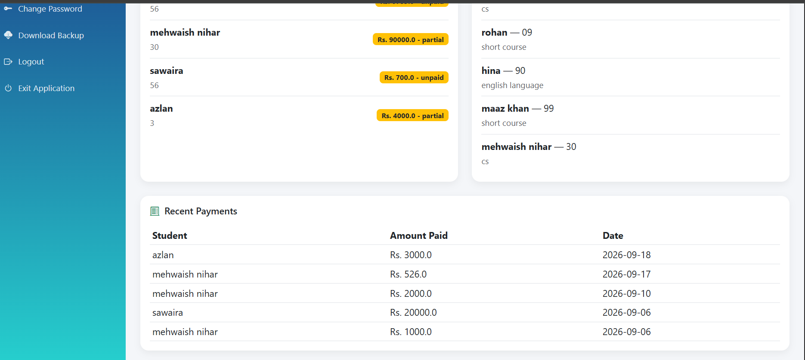
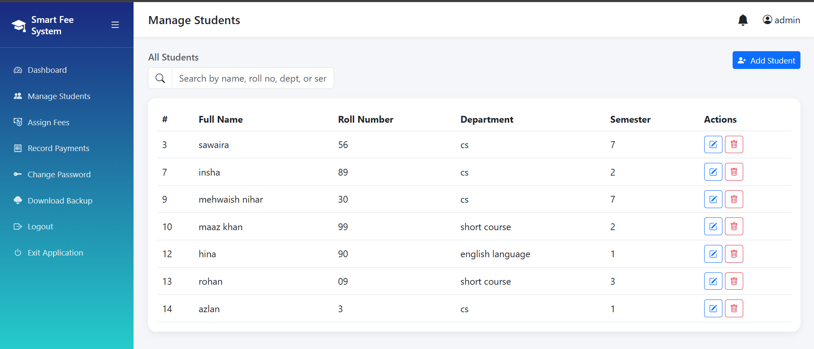
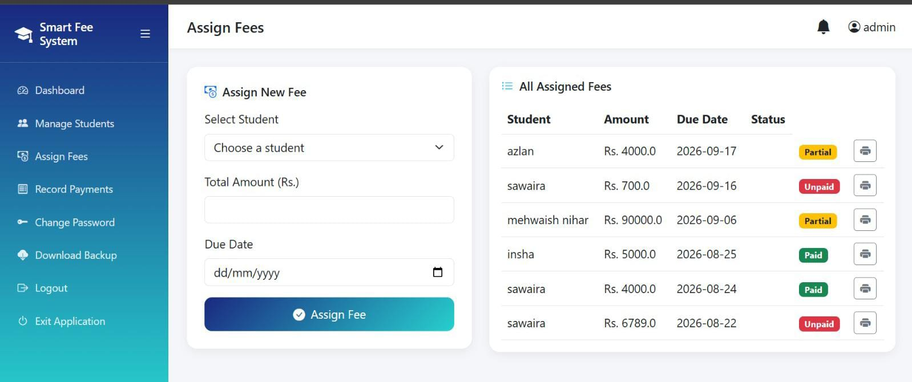
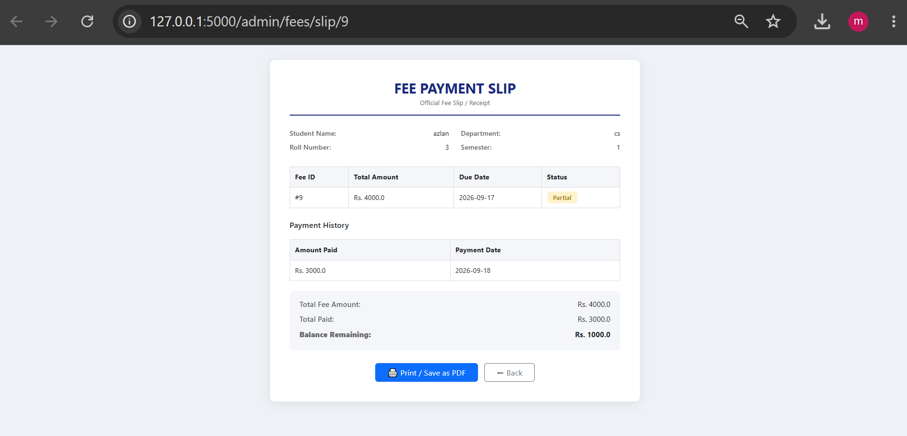
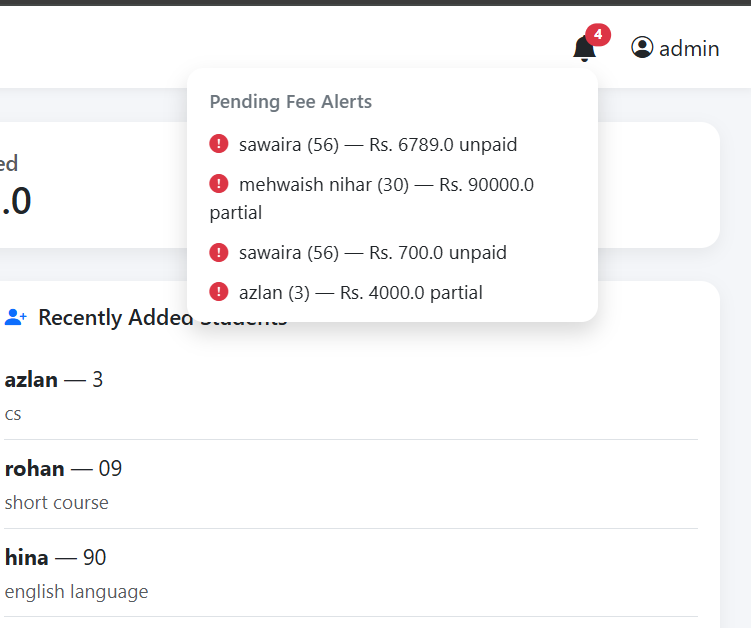
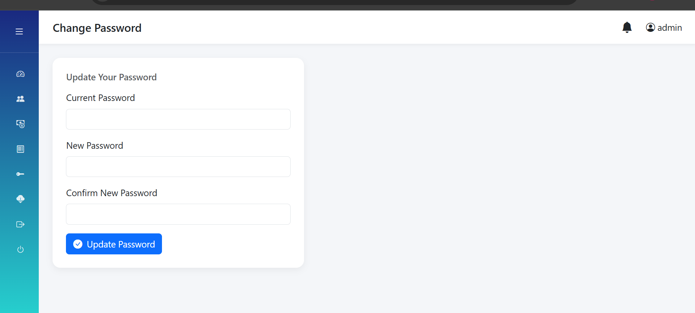
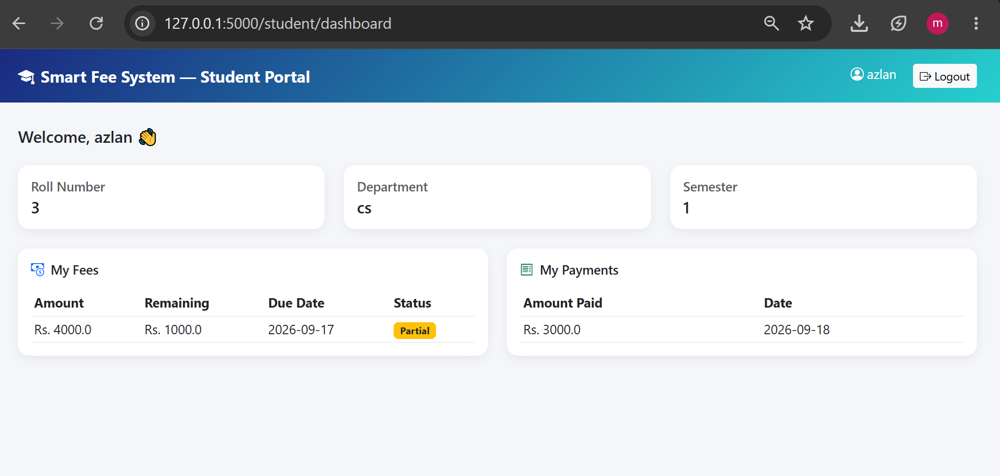

# Smart Fee System

A full-stack web application for managing student records, fee assignments, and payment tracking — built for real-world use by a small academy.

**Built by Aiman Nihar**

---

## Overview

Smart Fee System is a role-based web app that lets an administrator manage students, assign fees, and record payments, while students log in independently to view their own fee status and payment history. The system is actively deployed and in use by a real academy for day-to-day fee tracking.

The project was engineered for two different real-world deployment needs:
- A **live web version**, hosted online and accessible from any device via a browser link
- A **standalone offline desktop version**, packaged as a single Windows executable for a non-technical end user with no internet access and no ability to install software

## Features

- **Role-based access** — separate admin and student logins, each seeing only what's relevant to them
- **Student management** — add, edit, and remove student records, with account creation handled automatically
- **Fee assignment** — assign fees with due dates and track status (unpaid / partial / paid)
- **Payment recording** — log payments against specific fees, with automatic status updates
- **Automatic remaining-balance calculation** — students see exactly how much they still owe per fee
- **Printable fee slips** — official-style payment receipts, viewable and printable/exportable as PDF
- **Admin password management** — change password securely from within the dashboard
- **Automatic and manual database backups** — the system silently backs up its own database on every startup, plus a one-click manual backup/download option
- **Collapsible sidebar UI** — clean, responsive interface built with Bootstrap 5
- **Two deployment modes** — live web hosting and a fully offline, self-contained desktop executable, chosen based on the end user's technical comfort and internet access

## Tech Stack

- **Backend:** Python, Flask
- **Database:** SQLite
- **Frontend:** HTML, Bootstrap 5, Bootstrap Icons, Jinja2 templating
- **Packaging:** PyInstaller (for the offline desktop version)
- **Hosting:** PythonAnywhere (for the live web version)

## Screenshots

**Login**


**Admin Dashboard**



**Manage Students**


**Assign Fees**


**Fee Slip**


**notifications**


**Change Password**


**Student Dashboard**


## Project Structure

```
smart-fee-system/
├── app.py                  # Application routes and core logic
├── config.py                # Configuration (database path, secret key)
├── database.py               # Database connection handling
├── schema.sql                # Database table definitions
├── init_db.py                # One-time database setup script
├── requirements.txt           # Python dependencies
├── screenshots/               # Project screenshots
└── templates/                # HTML templates (login, dashboards, forms, etc.)
```

## Running It Locally

1. Clone the repository:
   ```
   git clone https://github.com/AIMAN-NIHAR/fee-management-system.git
   cd fee-management-system
   ```
2. Install dependencies:
   ```
   pip install -r requirements.txt
   ```
3. Initialize the database:
   ```
   python init_db.py
   ```
4. Run the app:
   ```
   python app.py
   ```
5. Open your browser to `http://127.0.0.1:5000`

## Deployment Notes

This project was deployed in two forms based on the end user's needs:

- **Web deployment:** Hosted on PythonAnywhere for browser-based access from any device with internet.
- **Offline desktop deployment:** Packaged into a standalone Windows executable using PyInstaller for a non-technical end user with no internet access — includes automatic startup backups and a safe in-app "Exit Application" control, so no command line or task manager interaction is ever required.

## Author

**Aiman Nihar**
GitHub: [AIMAN-NIHAR](https://github.com/AIMAN-NIHAR)